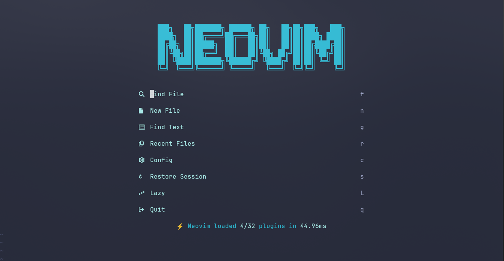
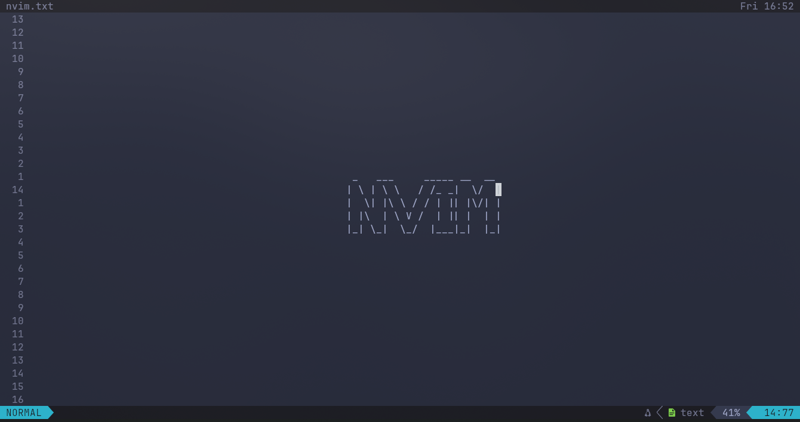

# **Introduction**



<hr>

**Ready to go modern** nvim lua configuration using **Lazy Plugin Manager**.</br>
Best for C/CPP & rust & python.</br>
This is some-what lightweight... also 😅.

> [!IMPORTANT]
> **Dependencies for Linux**
> + git
> + curl
> + ripgrep
> + nodejs npm
> + rust nightly (if building blink.cmp)

> [!NOTE] for window use healthcheck to figure out Dependencies

## ✨ Configure and Setup

* For Linux

```
cd ~/.config && git clone https://github.com/lielibert/nvim.git
```
* For Windows

```
cd %LOCALAPPDATA% && git clone https://github.com/lielibert/nvim.git
```

## 📁 Folder Structure

```
├── LICENSE
├── README.md
├── init.lua
├── lazy-lock.json
├── lua
│   ├── config
│   └── plugins
└── snippets
```

## 🔥Plugins

| **Theme** | base-16-color |
| **File** | mini.files |
| **lsp** | installed vai mason.nvim managed by ensure.nvim |
| **Complition** | blink.cmp |
| **Snippets** | luasnip + nvim-scissor + friendly-snippets |
| **Git** | gitsigns + diffview + neogit, or use mini.git |

+ Also contain features like
    + treesitter, textobject
    + lualine
    + multicursor
    + mini.nvim
    + raindow-delimiters
+ Enhanced UI using noice.nvim and snacks.nvim
+ Also contain Plugin for AI (copilot), can be enable in init.lua file
+ Use browser for AI chat, nothing is perfect.

### Tips
> Install clipboard and clipboard manager in linux <br>
> Use ocs52 in nvim to copy text in nvim from remote machine to local machine <br>

<hr>



